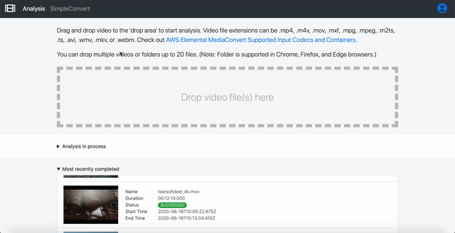
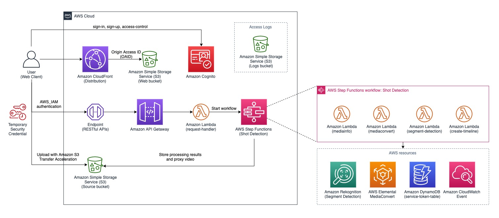
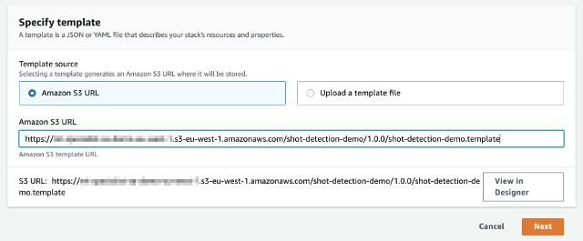
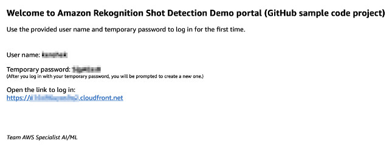

# Amazon Rekognition Shot Detection Demo using Segment API

This demo solution demostrates how to use [Amazon Rekognition Video Segment Detection](https://docs.aws.amazon.com/rekognition/latest/dg/segments.html) to detect shot segments _whenever a camera shot has changed_ and technical cues such as _Black Frames_, _End Credits_, and _Color Bar_.

The demo solution consists of three components, a backend AWS Step Functions state machine, a frontend web user interface, and an Amazon API Gateway RESTful endpoint. The backend state machine uses AWS Elemental MediaConvert to create proxy video and JPEG thumbnails (for streaming and analysis purposes), and runs Amazon Rekognition Video Segment detection to extract the shot segments and technical cues metadata. The frontend web user interface allows user to upload video(s), monitors the detection process, and view the detection results. The frontend and backend communicate through an RESTful API endpoint created by Amazon API Gateway.

The animated GIFs illustrate how this demo solution works.

## Upload, analyze, and view detection results


## Export and import Edit Decision List (EDL) to editing software

An example of importing EDL to [Adobe Premiere Pro](https://www.adobe.com/products/premiere.html)


__


An example of importing EDL to [Blackmagic Design Davinci Resolve 16](https://www.blackmagicdesign.com/products/davinciresolve/).


## Simple convert JSON to EDL
The demo solution also exposes the web user interface (SimpConvert tab) to convert the JSON result from Amazon Rekognition Segment API into Edit Decision List (EDL) without running the analysis process.



___

# Architecture overview

The solution is designed with [serverless architecture](https://aws.amazon.com/serverless/). The architectural diagram below illustrates an overview of the solution.



User first signs in to the web portal using Amazon Cognito service. The web application is hosted on an Amazon Simple Storage Service (S3), a **web bucket** indicated in the diagram. The web bucket is protected by Amazon CloudFront distribution with [Origin Access Identity (OAID)](https://docs.aws.amazon.com/AmazonCloudFront/latest/DeveloperGuide/private-content-restricting-access-to-s3.html) which restricts direct access to the bucket.

Upon sign-in, the user is authenticated and is given a temporary security credential to access limited AWS resources such as permission to call a specific Amazon API Gateway endpoint and permission to upload video(s) to a specific Amazon Simple Storage Service (S3) bucket, the **source bucket**. The source S3 bucket is configured to take advantage of [Amazon S3 Transfer Acceleration](https://docs.aws.amazon.com/AmazonS3/latest/dev/transfer-acceleration.html).

The analysis workflow can only be accessed through Amazon API Gateway endpoint where the incoming requests are authenticated with AWS_IAM, the temporary security credential. The API endpoint invokes a lambda function to handle the incoming requests.

An Amazon S3 logs bucket is created to store access logs from Amazon S3 buckets and Amazon CloudFront distribution.

Learn more about the implementation of:
* [RESTful API Component](./source/api/README.md)
* [Shot Detection State Machine](./source/step/README.md)
* [Webapp Component](./source/webapp/README.md)
* [Custom Resources Component used by AWS CloudFormation stack](./source/custom-resources/README.md)

___

# Launching solution with Pre-built AWS CloudFormation Template

The solution is deployed using an AWS CloudFormation template with AWS Lambda backed custom resources. To deploy the solution, use one of the following CloudFormation templates and follows the instructions.

| AWS Region | AWS CloudFormation Template URL |
|:-----------|:----------------------------|
| EU (Ireland) |<a href="https://console.aws.amazon.com/cloudformation/home?region=eu-west-1#/stacks/new?stackName=shot-detection&templateURL=https%3A%2F%2Fml-specialist-sa-demo-eu-west-1.s3-eu-west-1.amazonaws.com%2Fshot-detection-demo%2F1.0.0%2Fshot-detection-demo.template" target="_blank">Launch stack</a> |
| US East (N. Virginia) |<a href="https://console.aws.amazon.com/cloudformation/home?region=us-east-1#/stacks/new?stackName=shot-detection&templateURL=https%3A%2F%2Fml-specialist-sa-demo-us-east-1.s3.amazonaws.com%2Fshot-detection-demo%2F1.0.0%2Fshot-detection-demo.template" target="_blank">Launch stack</a> |
| US East (Ohio) |<a href="https://console.aws.amazon.com/cloudformation/home?region=us-east-2#/stacks/new?stackName=shot-detection&templateURL=https%3A%2F%2Fml-specialist-sa-demo-us-east-2.s3.amazonaws.com%2Fshot-detection-demo%2F1.0.0%2Fshot-detection-demo.template" target="_blank">Launch stack</a> |
| US West (Oregon) |<a href="https://console.aws.amazon.com/cloudformation/home?region=us-west-2#/stacks/new?stackName=shot-detection&templateURL=https%3A%2F%2Fml-specialist-sa-demo-us-west-2.s3-us-west-2.amazonaws.com%2Fshot-detection-demo%2F1.0.0%2Fshot-detection-demo.template" target="_blank">Launch stack</a> |
| Asia Pacific (Tokyo) |<a href="https://console.aws.amazon.com/cloudformation/home?region=ap-northeast-1#/stacks/new?stackName=shot-detection&templateURL=https%3A%2F%2Fml-specialist-sa-demo-ap-northeast-1.s3-ap-northeast-1.amazonaws.com%2Fshot-detection-demo%2F1.0.0%2Fshot-detection-demo.template" target="_blank">Launch stack</a> |


* Under **Create stack** page, click **Next** to continue



* In **Specify stack details** page, provide **Email** and **Price Class** parameters as follows. Click **Next** to continue


* In **Review stack** page, scroll to the bottom and make sure **I acknowledge that AWS CloudFormation might create IAM resources.** under **Capabilities** is checked. Then, click on **Create stack**


The stack creation takes roughly 15 minutes to complete the stack as Amazon CloudFront distribution takes about 15 minutes to propagate to the edge locations.

__

After the stack is created (~15 minutes), you should receive an invitation email from no-reply@verificationmail.com. The email contains an Amazon CloudFront URL link to access the demo portal, your login username, and a temporary password.



___

# Building and customizing the solution

## Build Environment
The sample code is written in NodeJS v10.x. Before you start, please make sure NodeJS has been installed. You would also need to create an Amazon Simple Storage Service (Amazon S3) bucket to store the build artifacts. 


### NodeJS
Make sure you install NodeJS 10.x or above onto your system.

For MAC user, download and install from [nodejs.org](https://nodejs.org/en/download/). Alternatively, you can also use Homebrew.

For Linux or Amazon EC2 user, follow [Tutorial: Setting Up Node.js on an Amazon EC2 Instance](https://docs.aws.amazon.com/sdk-for-javascript/v2/developer-guide/setting-up-node-on-ec2-instance.html)

For Windows 10 user, make sure to install [Windows Subsystem for Linux](https://docs.microsoft.com/en-us/windows/wsl/install-win10) before installing NodeJS. The build and deploy scripts are written in Bash script.


### AWS CLI

The **deploy-s3-dist.sh** shell script uploads the build artifacts to your S3 bucket; thus, it requires [AWS CLI](https://docs.aws.amazon.com/cli/latest/userguide/cli-chap-install.html) to be installed and configured.

```shell
# after AWS CLI is installed, run the command and follow the instruction to configure your profile

aws configure

```

### Amazon S3 Bucket

Create a S3 bucket to store the build artifacts: AWS CloudFormation (CFN) templates and Amazon Lambda packages.

Note: make sure to choose the region you intend to run the workflow; for example, us-east-1 region.


__

## To build the sample code,
* Clone the repository

```shell
git clone git@github.com:awslabs/amazon-rekognition-shot-detection-demo-using-segment-api.git

```

* Change directory to **deployment** and run **build-s3-dist.sh**

```shell
cd amazon-rekognition-shot-detection-demo-using-segment-api/deployment
bash build-s3-dist.sh --bucket your-bucket

```

* Deploy the package to your S3 bucket

```shell
bash deploy-s3-dist.sh --bucket your-bucket

# optionally you could specify different AWS CLI Profile,
# AWS CLI profile (default to 'default')
# and ACL settings (default to bucket-owner-full-control)
bash deploy-s3-dist.sh --bucket your-bucket \
--profile DevProfile \
--acl public-read

```

Now you should have all the code packages and CFN templates uploaded to your S3 bucket.

Log in to [AWS S3 Console](https://s3.console.aws.amazon.com/s3/home) and navigate to the bucket you created.

Make sure you see the following files under **/shot-detection-demo/1.0.0/**

| Name | Description |
|:---  |:------------|
| shot-detection-demo.template | cloudformation template to create the solution |
| shot-detection-demo-custom-resources-1.0.0.zip | a package of custom resource lambda function used by cloudformation template |
| shot-detection-demo-api-1.0.0.zip | a package of lambad functiom that handles GET, POST, and OPTIONS requests from Amazon API Gateway endpoint |
| shot-detection-demo-core-lib-1.0.0.zip | a lambda layer package of the core library shared among other lambda functions |
| shot-detection-demo-mediainfo-1.0.0.zip | a lambda layer package of mediainfo used to extract media information of uploaded videos |
| shot-detection-demo-step-1.0.0.zip | a package of lamba function contained the actual implementation of each state of AWS Step Functions state machine |
| shot-detection-demo-status-updater-1.0.0.zip | a package of lambda function to receive events from Amazon CloudWatch Event and Amazon Simple Notification Service (SNS) and to send task result signaling the AWS Step Functions state machine execution when a task is completed or failed. |
| shot-detection-demo-webapp-1.0.0.zip | a package of the webapp code |

___

# Launching your customized solution

This section covers two different methods to deploy your customized solution: 1) using AWS CloudFormation Console and 2) using AWS CLI command.

### Method 1: Using AWS CloudFormation Console
* Log on to [AWS CloudFormation Console](https://console.aws.amazon.com/cloudformation/home)
* Click on **Create stack** with new resources (standard)
* Follow the [instruction](#launch-solution-with-aws-cloudformation-stack) described earlier. **Make sure to specify the S3 location of your customized CloudFormation template under the _Amazon S3 URL_ field**.

### Method 2: Using AWS CLI Command
* Create a JSON input file as follows and save it locally; ie., cfn-input.json

```json
[
  {
    "ParameterKey": "Email",
    "ParameterValue": "yourname@email.com"
  },
  {
    "ParameterKey": "PriceClass",
    "ParameterValue": "Use Only U.S., Canada and Europe [PriceClass_100]"
  }
]

```
* Run the following AWS CLI command to create the stack

```shell
aws cloudformation create-stack \
--stack-name shot-detection \
--template-url https://your-bucket.s3.amazonaws.com/shot-detection-demo/1.0.0/shot-detection-demo.template  \
--parameters file://cfn-input.json \
--capabilities "CAPABILITY_IAM"

```

___

# Deleting the demo solution
To delete the demo solution, simply delete the CloudFormation stack that was deployed earlier.

**Important note:** deleteing the CloudFormation stack does _NOT_ remove the following resources. Therefore, make sure you manually clean up these resources to avoid potential recurring cost.
* Amazon S3 bucket (web)
* Amazon S3 bucket (source)
* Amazon S3 bucket (logs)

___

# Security

When you build systems on AWS infrastructure, security responsibilities are shared between you and AWS. This shared model can reduce your operational burden as AWS operates, manages, and controls the components from the host operating system and virtualization layer down to the physical security of the facilities in which the services operate. For more information about security on AWS, visit the [AWS Security Center](https://aws.amazon.com/security).

## Server-Side Encryption
AWS highly recommends that customers encrypt sensitive data in transit and at rest. This demo solution automatically encrypts image files and metadata at rest with [Amazon Simple Storage Service (Amazon S3) Server-Side Encryption (SSE)](https://docs.aws.amazon.com/AmazonS3/latest/dev/serv-side-encryption.html).


## Amazon CloudFront
This demo solution deploys a static website [hosted](https://docs.aws.amazon.com/AmazonS3/latest/dev/WebsiteHosting.html) in an Amazon S3 bucket. To help reduce latency and improve security, this solution includes an Amazon CloudFront distribution with an origin access identity, which is a special CloudFront user that helps restrict access to the solution’s website bucket contents. For more information, see [Restricting Access to Amazon S3 Content by Using an Origin Access Identity](https://docs.aws.amazon.com/AmazonCloudFront/latest/DeveloperGuide/private-content-restricting-access-to-s3.html).

___

# Cost Estimation
The solution uses various AWS services. Please make sure to check the pricing for each of the services.

* [Amazon Rekognition Segment Detection](https://aws.amazon.com/rekognition/pricing/)
* [AWS Elemental MediaConvert](https://aws.amazon.com/mediaconvert/pricing/)
* [Amazon S3](https://aws.amazon.com/s3/pricing/)
  * Intelligent - Tiering
  * Transfer acceleration
* [Amazon CloudFront - on-demand](https://aws.amazon.com/cloudfront/pricing/)
* [Amazon Lambda - request and duration](https://aws.amazon.com/lambda/pricing/)
  * 128MB Memory for status-updater lambda
  * 128MB Memory for shot-detection-large state lambda (mediainfo)
  * 256MB Memory for api lambda to handle OPTIONS, GET, POST requests
* [Amazon DynamoDB - on-demand](https://aws.amazon.com/dynamodb/pricing/on-demand/)
* [Amazon Simple Notification Service](https://aws.amazon.com/sns/pricing/)
* [Amazon Cognito](https://aws.amazon.com/cognito/pricing/)
* [Amazon API Gateway - REST API](https://aws.amazon.com/api-gateway/pricing/)
* [AWS CloudFormation](https://aws.amazon.com/cloudformation/pricing/)
* [Amazon CloudWatch Event](https://aws.amazon.com/cloudwatch/pricing/)

## Pricing example

Let's assume that we have a 60-minute video with H.264, 1920x1080@24fps@8Mpbs. The total file size is 3.6GB.
Let's also assume that we are using **US East (N. Virginia)** region.

### Cost breakdown

The cost of Amazon Cognito and AWS CloudFormation are not included in the estimation.

| Stage | Cost Type | Unit Cost | # of Requests | Cost Per Item |
|:------|:----------|:----------|:--------------|:--------------|
| Upload | Amazon S3 Transfer Acceleration | $0.04 per GB | 3.6GB | $0.144 |
| Upload | Amazon S3 Storage | $0.023 per GB / Month | 3.6GB | $0.0828 |
| Mediainfo State (State Machine) | Amazon Lambda Duration (1024MB Memory) | $0.0000016667 per 100ms | 1 * 1500ms | $0.000025 |
| MediaConvert State (State Machine) | Amazon Lambda Duration (128MB Memory) | $0.0000002083 per 100ms | 1 * 2420ms | $0.000005 |
| Rekognition Segment State (State Machine) | Amazon Lambda Duration (128MB Memory) | $0.0000002083 per 100ms | 1 * 1892ms | $0.000004 |
| Create timeline State (State Machine) | Amazon Lambda Duration (128MB Memory) | $0.0000002083 per 100ms | 1 * 754ms | $0.0000015 |
| AWS Elemental MediaConvert | On-Demand Professional Tier | $0.024 per minute | 60min | $1.44 |
| Amazon Rekognition Segment Detection | Per Feature | $0.05 per minute | 60mins * 2 | $6 |
| Amazon DynamoDB (Service Integration) | On-Demand Write | $1.25 per million | 1 | $0.00000125 |
| Amazon DynamoDB (Service Integration) | On-Demand Read | $0.25 per million | 1 | $0.00000025 |
|Amazon SNS Topic | Publish | $0.50 per 1M | 1 | $0.0000005 |
| | | | **Total Cost** | **$7.67** |

### A few notes
* Total cost to try out the demo solution for an one-hour long HD video is $7.67.
* The Upload (Amazon S3 Storage) cost ($0.0828) is a monthly cost.
* The demo uses both Shot Segment and Technical Cues features. Therefore, the detection cost is multiplied by two.
* The demo uses AWS Elemental MediaConvert Professional Tier features such as:
  * [Quality Defined Variable Bitrat (QVBR)](https://aws.amazon.com/media/tech/quality-defined-variable-bitrate-qvbr/) to optimize quality and file size and
  * QuickTime output format to carry SMPTE Timecode from original content

___

# Supported Regions

Amazon Rekognition Video Segment API is supported in the following regions:
* US East (N. Virginia) (us-east-1)
* US East (Ohio) (us-east-2)
* US West (N. California) (us-west-1)
* US West (Oregon) (us-west-2)
* Europe (Frankfurt) (eu-central-1)
* Europe (Ireland) (eu-west-1)
* Europe (London) (eu-west-2)
* Asia Pacific (Mumbai) (ap-south-1)
* Asia Pacific (Seoul) (ap-northeast-2)
* Asia Pacific (Singapore) (ap-southeast-1)
* Asia Pacific (Sydney) (ap-southeast-2)
* Asia Pacific (Tokyo) (ap-northeast-1)

Make sure to check [AWS Region Table](https://aws.amazon.com/about-aws/global-infrastructure/regional-product-services/) for any updated region support for the service.

___

# Resources

## AWS services
The solution uses the following AWS resources:

* [Amazon S3](https://aws.amazon.com/s3/) Buckets (x3)
  * a web bucket to host the web application
  * a source bucket to store images for training data, images for analysis, and dataset manifests
  * a log bucket to store access logs from other AWS resources used in the demo solution
* [Amazon Lambda](https://aws.amazon.com/lambda/) (x3)
  * an API backend lambda function to handle POST request with 1024MB Memory
  * a smaller instance with 256MB Memory of the same lambda function to handle GET and OPTIONS requests
  * a Custom Resource lambda funciton with 256MB Memory to provision resources during the stack creation
* [Amazon Cognito](https://aws.amazon.com/cognito/)
  * an User Pool and Identity Pool to provide sign-in, sign-up, and authentication
* [Amazon API Gateway](https://aws.amazon.com/api-gateway/)
  * RESTful API endpoints to interact with web appplication
* [Amazon CloudFront](https://aws.amazon.com/cloudfront/)
  * a CloudFront distribution to host web application
* [Amazon Rekognition](https://aws.amazon.com/rekognition/)
  * Video Segment detection APIs to extract shot segments and technical cues (black frame and end credits)
* [AWS Elemental MediaConvert](https://aws.amazon.com/mediaconvert/pricing/)
  * Create a MP4 proxy of the original video for analysis and streaming purposes
* [AWS Step Functions](https://aws.amazon.com/step-functions/pricing/)
  * A state machine that implements the core logic
* [Amazon DynamoDB](https://aws.amazon.com/dynamodb/pricing/)
  * a dynamoDB table to temporarily store Step Functions execution service token, used to communicate back to the state machine
* [Amazon Simple Notification Service (SNS)](https://aws.amazon.com/sns/pricing/)
  * a SNS topic, used by Amazon Rekognition to send notification to our process when a detection job is completed
* [Amazon Identity and Access Management](https://aws.amazon.com/iam/)
  * IAM Roles for the custom resource and the Lambda function
* [AWS CloudFormation](https://aws.amazon.com/cloudformation/)

___

# Attributions

Images and videos used in this README are courtesy of the Blender Foundation, shared under [Creative Commons Attribution 3.0](http://creativecommons.org/licenses/by/3.0/) license.

Tears of Steel: (CC) Blender Foundation | [mango.blender.org](https://mango.blender.org/)

___

# License

[MIT-0](./LICENSE.txt)

___

Next to [RESTful API Component](./source/api/README.md)
